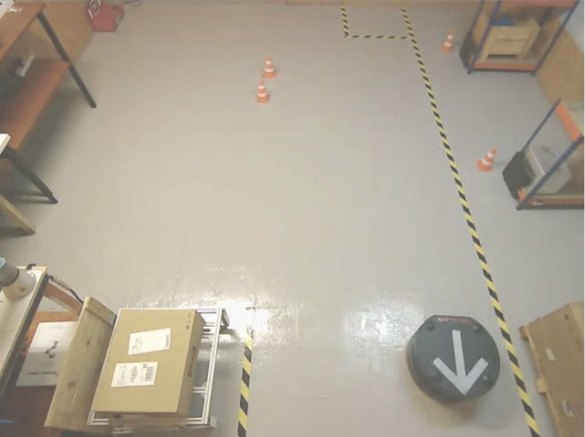

# project_part2

## Dependencies

Some of the needed URDF files aren't yet publicly available. The files are only available to me within my **Phase 2** workspace at The Construct, though
I am working to change this.

- [phase2_custom_interfaces](https://github.com/christophomos/phase2_custom_interfaces)
- [linear_algebra_tools](https://github.com/christophomos/linear_algebra_tools)
- [elevator](https://github.com/christophomos/elevator)

Moves an RB1 robot into a cart using laser and odometry data. It demonstrates the concepts of
[The Construct](https://www.theconstructsim.com/)'s <ins>ROS2 Basics C++</ins> course. As of July 27, 2022, I'm still adding features.



Concepts:
- Multithreaded programming using multi-threaded executors and reentrant callback groups: avoid race conditions and increase performance.
- Use the ROS1-ROS2 bridge to use the RB-1 Base, which has a ROS1-based stack.
- Components (no main function)
- Subscription and publication of topics
- Publish and listen to tf data
- Make decisions using odometry and laser data.
- A ROS2 parameter adapts the algorithm to either Gazebo or a real RB1 in the Construct's [RoBox](https://www.theconstructsim.com/robox/) lab.


Currently, the project is in development, without a public [Rosject](https://www.theconstructsim.com/rosjects/) with public access, but here are the current steps needed to run the project within my own development environment.

# Setup

Clone this project as well as its above dependencies into your ros2_ws/src.

If running in simulation, created a shell named `gz`
```
source ~/simulation_ws/devel/setup.bash
roslaunch rb1_base_gazebo warehouse_rb1.launch
```
In the the `bridge` shell
```
source ~/catkin_ws/devel/setup.bash
roslaunch load_params load_params_base.launch

source /opt/ros/foxy/setup.bash
ros2 run ros1_bridge parameter_bridge
```
To verify the bridge is working, in your `teleop` window run
```
ros2 run teleop_twist_keyboard teleop_twist_keyboard --ros-args --remap cmd_vel:=/robot/cmd_vel
```

To diagnose `ros1 info`
```
source /opt/ros/noetic/setup.bash
rosparam get /topics
```
For `ros2 info`
```
ros2 topic list
```

Now create a `build` shell. You must compile phase2_custom_interfaces before the rest of the packages
```
colcon build --packages-select phase2_custom_interfaces
. install/setup.bash
colcon build --symlink-install
. install/setup.bash
```

## Run the OLD version of the project, which uses ROS2 components

This version is only compatible with gazebo and not very robust to variations in the robot or cart starting locations. It moves the RB-1
close to the cart.

In the ´git´ window, checkout tag ´components´ of project_part2
´´´
git checkout
´´´
In your ´build´ window, rebuild and source
´´´
colcon build --symlink-install
. install/setup.bash
´´´
Now launch

```
ros2 launch project_part2 subs_scan_pub_cmd.launch.py
```
Run the elevator service, which wraps around the elevator_up and elevator_down topics
```
ros2 run project_part2 elevator_service
```

## Run the current version of the project

1. `pre_approach` moves RB1 close enough to view the entrance to the cart. Make sure to set the `is_gazebo` parameter in the pre-approach launch file appropriately.
```
ros2 launch project_part2 pre_approach.launch.py

```

2. `detect_shelf` (use a separate shell) uses laser data to detect the legs of the cart and publishes the transform `static-cart`
```
cd ros2_ws/
. install/setup.bash
ros2 launch project_part2 detect_shelf.launch.py
```
If needed, get the tf of laser on the command line
```
ros2 run tf2_ros tf2_echo robot_odom robot_front_laser_link
```
3. Verify the static_cart tf using rviz2
```
ros2 run rviz2 rviz2
```
Now load the configuration: ros2_ws/src/project_part2/rviz/project_part2.rviz

3. Enter the cart using odometry data and the `static_cart` transform (currently debugging)
```
ros2 launch project_part2 enter_cart.launch.py
```

4. Activate the elevator
```
ros2 run elevator elevator_service_server
```
In a separate window:
Raise the elevator
```
ros2 service call /elevator phase2_custom_interfaces/srv/Elevator is_up:\ true\
```
Lower the elevator
```
ros2 service call /elevator phase2_custom_interfaces/srv/Elevator is_up:\ false\
```
